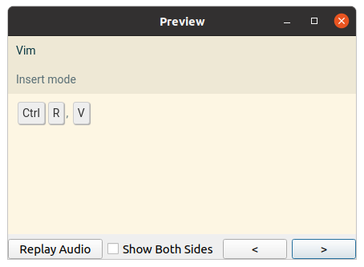
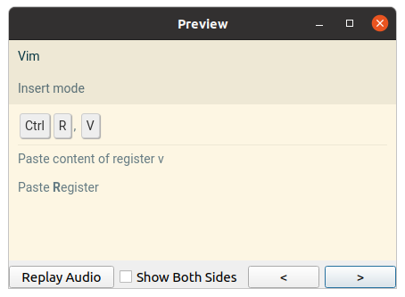
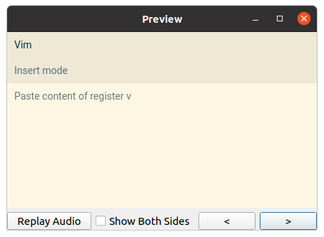
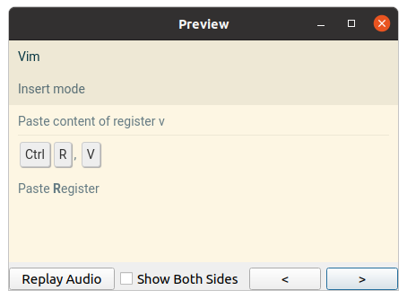

# Keyboard Shortcut

This note type serves for memorizing keyboard shortcuts for programs.

## Example

* `Program`: `Vim`
* `Program mode`: `Insert mode`
* `Shortcut`: `Ctrl+R V`
* `Effect`: `Insert content of register <code>v</code> without leaving Insert mode`
* `Mnemonic`: `Paste <b>R</b>egister`

This note will generate 2 cards:

### Shortcut &rarr; effect

One card will ask you to describe what happens when you press the keyboard
shortcut in the program (in the given mode):

#### Front

#### Back

### Effect &rarr; shortcut

The other card will ask you to recall the shortcut for accomplishing the given
effect in the program (in the given mode):

#### Front

#### Back

## Fields

### `Program`

If this field is not empty, it will be used as the heading of the card.
See [heading documentation](/src/shared_styles/heading.md) for what happens when
it's not present.

### `Program mode`

If this field is not empty, it will be shown as a sub-heading. This is useful
for programs like Vim, where one keyboard shortcut may have different effects
based on the current program mode.

The program mode is shown on both front and back side of both cards.

### `Shortcut`

This field holds the keyboard shortcut.

To represent holding two keys at the same time, combine them with `+`.
To represent keys typed in sequence, separate them by a space.

For example:
*  `Ctrl+Alt+Delete` means "Press `Ctrl`, `Alt` and `Delete` at the same time".
*  `Ctrl+X A B` means "Press `Ctrl` and `X`. Release. Type `A`. Type `B`."

### `Effect`

This field contains the description of what happens when you type the keys.

### `Extra`

This field will be shown on the answer side of both generated cards.

Good uses for it include alternative ways to accomplish the same effect.
Unfortunately, key combinations are not rendered nicely in this field.
(TODO: fix? maybe add `Alternative` fields?)

### `Mnemonic`

This field will also be shown on the answer side of both generated cards.

### `TODO`, `Roam refs`, `Sources`

See [documentation of common metadata fields](/src/shared_styles/metadata.md).
